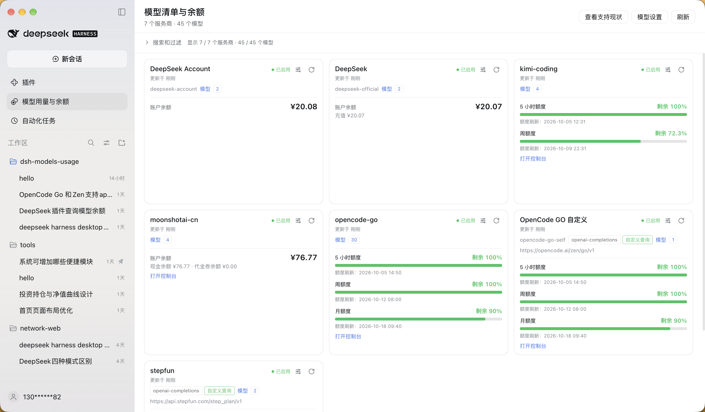
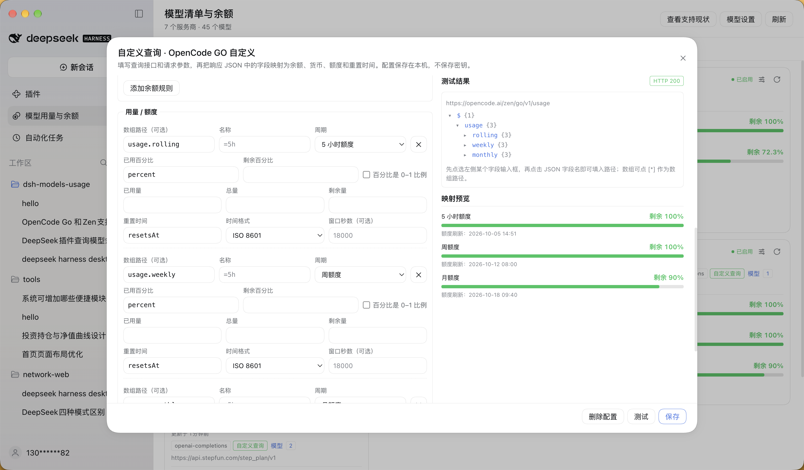

# dsh-models-usage（模型用量与余额）

[English](README.en.md)

DeepSeek Harness 插件，汇总当前已配置的服务商和模型，并展示服务商账户余额或订阅额度。

## 示例





## 功能

- 查看服务商、模型及上下文、输入类型等模型信息，并支持搜索和筛选。
- 查询部分服务商的官方余额或额度；无法自动查询的服务商会明确标注，并提供控制台入口，不会以 0 代替未知余额。
- 支持逐服务商刷新、额度重置时间和短期缓存。
- 可通过卡片上的「自定义查询」配置其他余额或额度接口，测试并预览字段映射。配置只保存请求模板，不保存 API 密钥。

余额与额度是**服务商账户级**信息，不按模型拆分。是否支持查询及所需凭据可在面板的「查看支持现状」中查看。

## 安装与使用

通过 CLI 安装：

```sh
dsh plugin add dsh-models-usage
```

也可以在 Harness 的 **Plugins → Add plugin** 中搜索或填写 `dsh-models-usage`，然后启用插件。

启用后，从左侧打开「模型用量与余额」面板。面板需要一个活动会话；点击顶部刷新按钮可更新数据。也可在会话中使用：

```text
/dsh-models-usage [summary|detail|refresh] [provider=<id>]
```

`models_balance` 工具会返回同一份数据，供模型调用。

## 配置

在 `cordis.patch.yml` 的 `models-usage` 插件配置中可调整：

| 选项 | 默认值 | 说明 |
| --- | --- | --- |
| `includeModelDetails` | `true` | 是否加载模型上下文、能力等详细信息 |
| `includeDormantProviders` | `false` | 是否包含尚未配置或未激活的服务商 |
| `locale` | `zh-CN` | 上报给余额接口的语言 |
| `clientVersion` | `0.2.0-rc.2` | 上报给余额接口的客户端版本 |
| `customQueryFile` | 空 | 自定义查询配置文件路径；默认是 `$DSH_HOME/storages/dsh-models-usage.custom-queries.json` |

## 开发

```sh
npm install --legacy-peer-deps
npm run typecheck
npm run build
```

## 限制

- 面板通过当前活动会话与 Host 通信；没有活动会话时，请先打开一个会话。
- 并非所有服务商都提供可用模型密钥访问的余额接口。插件不会使用控制台 Cookie 或把套餐额度折算成现金余额。
- 余额是账户级数据，不能按单个模型拆分。

## 许可证

[MIT](LICENSE)
